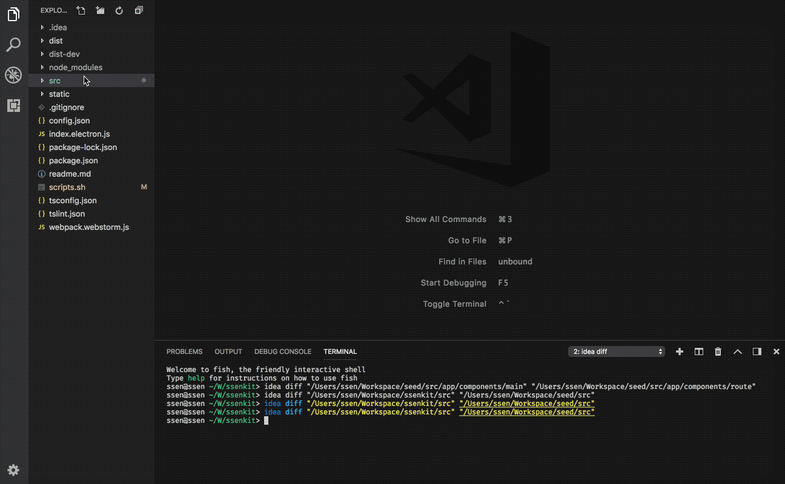

# Execute `idea diff {dir} {dir}` command in VSCode

1. This extension requires `idea` command line tool installation. <https://www.jetbrains.com/help/idea/working-with-the-ide-features-from-command-line.html>
2. This extension tested on OS X only.